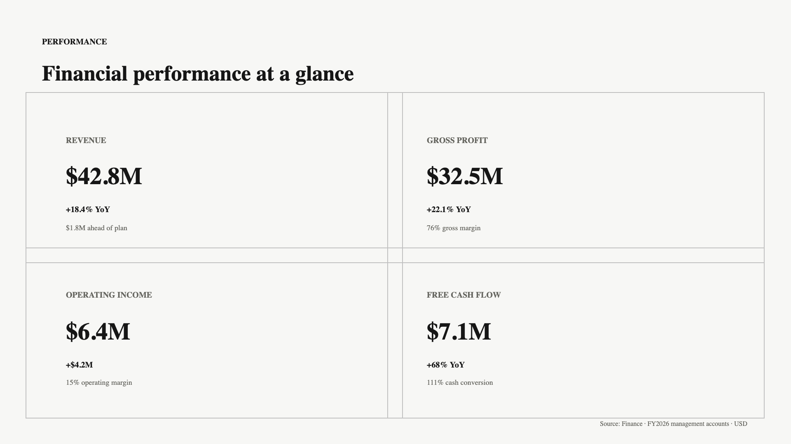
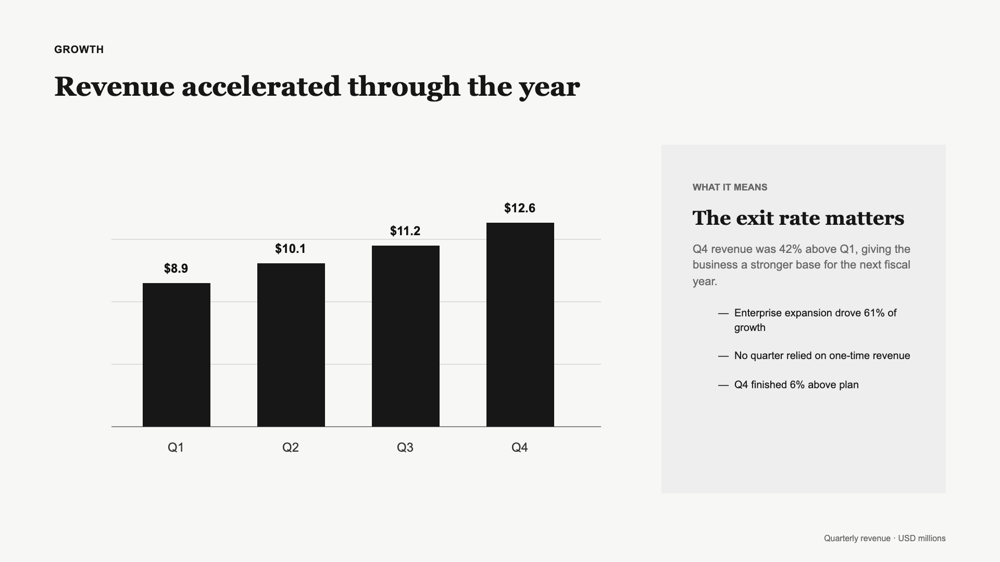
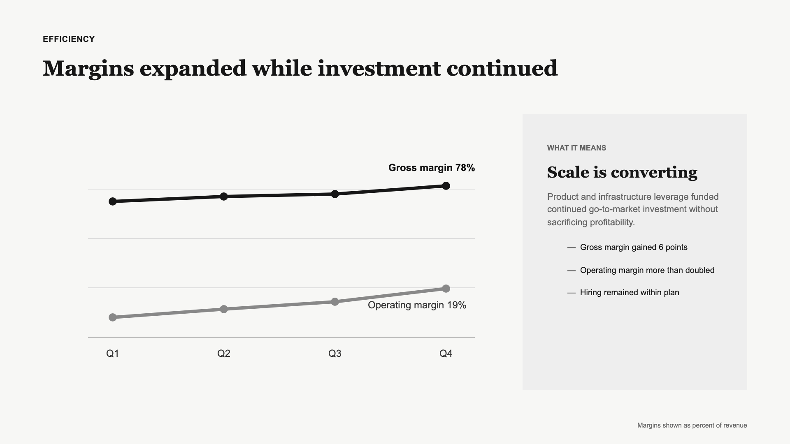

# pptcn

Beautiful, composable PowerPoint components for code and AI agents.

`pptcn` is a shadcn-style component library for programmatic PowerPoint generation. Install the components you need, own the source code, customize the design, and generate editable presentations from TypeScript or AI coding agents.

Every title, metric, bullet, and panel is a native PowerPoint object. The output is an ordinary `.pptx` file that remains editable in PowerPoint, Keynote, and compatible office suites.

## Preview







[Download the complete editable financial-summary deck](examples/financial-summary.pptx).

## Why pptcn

- Semantic APIs: describe the slide, not its coordinates.
- Designed defaults: strong type hierarchy, restrained color, and useful whitespace.
- Editable output: text and shapes stay native PowerPoint objects.
- Deterministic layouts: the same data and theme produce the same slide model.
- Agent-friendly TypeScript: explicit prop names and actionable overflow warnings.
- Source-owned components: use the package today or copy components through the included shadcn registry.

## Install

Install the small, stable package from npm:

```bash
npm install pptcn
```

Or install the latest source directly from GitHub:

```bash
npm install github:subhsaha/pptcn
```

Node.js 20 or newer is required.

## Quick start

```ts
import {
  ComparisonSlide,
  ChartSlide,
  MetricGrid,
  TitleSlide,
  createPresentation,
} from "pptcn";

const deck = createPresentation({ author: "Strategy team", title: "Q3 Business Review" });

deck.add(TitleSlide({
  eyebrow: "Quarterly review",
  title: "Building durable growth",
  subtitle: "Performance, customer signals, and next-quarter decisions.",
}));

deck.add(MetricGrid({
  title: "Momentum across the business",
  metrics: [
    { label: "Revenue", value: "$42.8M", change: "+18.4% YoY", trend: "up" },
    { label: "Retention", value: "118%", change: "+6 pts", trend: "up" },
    { label: "Gross margin", value: "76%", change: "+2.1 pts", trend: "up" },
    { label: "Sales cycle", value: "47 days", change: "−8 days", trend: "up" },
  ],
}));

deck.add(ComparisonSlide({
  title: "Build the platform, buy the commodity",
  left: { title: "Build", points: ["Own the workflow", "Create durable leverage"] },
  right: { title: "Partner", accent: "muted", points: ["Launch faster", "Reduce maintenance"] },
}));

await deck.write("output/review.pptx");
```

Long content is constrained deterministically. Inspect `deck.warnings` after adding slides to catch fields that were truncated instead of silently producing unreadable or out-of-bounds content.

## Components

| Component | Use it for |
| --- | --- |
| `TitleSlide` | Opening a deck with one clear idea |
| `MetricCard` | Giving a single metric the whole slide |
| `MetricGrid` | Comparing two to eight business metrics |
| `ComparisonSlide` | Explaining a two-sided choice or tradeoff |
| `ChartSlide` | Pairing an editable native chart with a right-side explanation |
| `DataTableSlide` | Showing editable tabular detail with monochrome status badges |

All components accept semantic content and return a `SlideComponent`. Pass that component to `deck.add(...)`; no PowerPoint coordinates are needed.

## Themes

Use `mergeTheme` for small changes or `defineTheme` for a complete design system:

```ts
import { createPresentation, defaultTheme, mergeTheme } from "pptcn";

const theme = mergeTheme(defaultTheme, {
  colors: { ...defaultTheme.colors, accent: "7C3AED" },
});

const deck = createPresentation({ theme });
```

## Source-owned registry

The repository builds shadcn-compatible registry items into `public/r`. When these files are hosted, install a component with the shadcn CLI:

```bash
npx shadcn@latest add https://raw.githubusercontent.com/subhsaha/pptcn/main/public/r/metric-grid.json
```

For the chart-and-explanation slide:

```bash
npx shadcn@latest add https://raw.githubusercontent.com/subhsaha/pptcn/main/public/r/chart-slide.json
```

And the table with semantic monochrome badges:

```bash
npx shadcn@latest add https://raw.githubusercontent.com/subhsaha/pptcn/main/public/r/data-table-slide.json
```

The registry item copies the component and its small runtime into your repository, so you can change every layout and design decision. Run `npm run registry:build` after modifying registry source files.

## Local development

```bash
npm install
npm run check
```

`npm run example` creates `output/demo.pptx`, containing a title slide, financial summary, and two editable chart-and-insight slides.

## Credit

`pptcn` is inspired by [pdfcn](https://github.com/shadcn-labs/pdfcn) from shadcn labs and follows the same source-owned, copy-paste-and-customize philosophy. PowerPoint generation is powered by [PptxGenJS](https://github.com/gitbrent/PptxGenJS).

This project is independent and is not affiliated with or endorsed by shadcn labs.

## License

[MIT](LICENSE)
